# Agentic-first SDLC — team playbook (short)

**Audience**: Any product team using AI coding agents (Cursor, Claude Code, etc.).  
**Goal**: Better **outcomes** (efficiency or productivity) with **quality**—not maximizing "% of lines from AI."

## 1. Principles

1. **Agent as primary author, human as director** — You specify intent, context, and acceptance; you review and own the result.
2. **Context is infrastructure** — `AGENTS.md`, README, rules, and clear naming reduce rework; stale context is debt.
3. **Human accountability** — Shipping code is always a human decision; "the agent did it" is not a root cause.
4. **Efficiency or productivity** — Same work with fewer people, or more value with the same team—pick the lens that fits your charter.

## 2. Context management

### Repository

- Maintain **`AGENTS.md`** (architecture, layout, conventions, pitfalls).
- **README**: how to build, test, run—not marketing fluff.
- Document naming patterns and error-handling philosophy if non-obvious.

### Issues / tickets

Write for someone who does not know the repo:

- **Goal** (outcome), **acceptance criteria** (testable), **files/modules**, **constraints**, **links** to prior art.

#### Jira-first (product engineering)

**If it’s not in Jira, it doesn’t exist** for trackable engineering work: features, bugs, spikes, tech debt, and meaningful refactors should have a **Jira issue before** implementation starts. Pair with **`skills/product-engineering.md`** for full discipline (agile as a team capability, Definition of Done, anti-patterns).

In **agentic** workflows specifically:

- **Start sessions with a ticket** — Point agents at a Jira key and acceptance criteria when asking for implementation; reduces scope drift and preserves traceability.
- **Commits and PRs carry the key** — Use the team’s convention (e.g. `PROJ-123` in the commit subject and/or PR title/description) so history links to work items.
- **Discovered work becomes tickets** — When an agent finds new bugs, tech debt, or follow-ups, **propose or create a Jira issue** instead of silently expanding the change set off-ticket.

### Sessions

- State scope, point to files, list **non-negotiables** (no API break, no new deps, etc.).
- If the session drifts, **reset** with a fresh summary or new session.

## 3. Development loop

```
Specify intent → Agent proposes changes → Human reviews → Refine or accept → Repeat
```

**Agents tend to be strong at**: boilerplate, refactors, tests, docs, localized bug fixes with reproducers.  
**Humans should lead**: novel architecture, security-sensitive paths, performance-critical design, ambiguous product trade-offs.

### Skills across the lifecycle

The `skills/` directory defines **tool-agnostic personas**. They are not a mandatory waterfall—teams pick what fits—but this map shows **when each skill typically applies** and how it connects to traceability (for example Jira keys in sessions, commits, and PRs).

```mermaid
flowchart LR
  subgraph planning [Planning]
    PM[product-manager]
    PE[product-engineering]
  end
  subgraph design [Design]
    UXD[uxd-experience-review]
  end
  subgraph implementation [Implementation]
    ENG[engineer]
  end
  subgraph testingPhase [Testing]
    TQE[test-writing-qe]
  end
  subgraph reviewPhase [Review]
    AQE[adversarial-qe]
    UXD2[uxd-experience-review]
  end
  subgraph securityPhase [Security]
    PS[product-security]
  end
  subgraph performancePhase [Performance]
    PERF[performance-agent]
  end
  subgraph documentation [Documentation]
    DW[docs-writer]
  end
  subgraph releaseReadiness [Release readiness]
    XE[xe-support-review]
  end
  planning --> design
  design --> implementation
  implementation --> testingPhase
  testingPhase --> reviewPhase
  reviewPhase --> securityPhase
  securityPhase --> performancePhase
  performancePhase --> documentation
  documentation --> releaseReadiness
```



| Skill file | Typical trigger | One-line role |
|------------|-----------------|---------------|
| `product-manager.md` | Backlog intake, roadmap, stakeholder asks | Requirements, epics/stories, Goal + Acceptance Criteria |
| `product-engineering.md` | Any trackable engineering work | Jira-first discipline, agile hygiene, Definition of Done |
| `uxd-experience-review.md` | New UX surface or shipped UX critique | Experience requirements (early) and structured UX review (late) |
| `engineer.md` | Ticket ready to implement | Jira to code, handoff to QE for tests |
| `test-writing-qe.md` | After implementation or alongside AC | Map acceptance criteria to tests |
| `adversarial-qe.md` | PR or high-risk change | Skeptical review of code and tests |
| `product-security.md` | Dependencies, images, releases | CVE/SBOM/license/supply-chain posture |
| `performance-agent.md` | Hot paths, SLO-sensitive changes | Benchmarks, baselines, regression vs targets |
| `docs-writer/` | User-facing or internal docs needed | Red Hat–style docs from requirements and tickets |
| `xe-support-review.md` | Pre-release or GA | Support-case risk, docs/errors/defaults clarity |

**Note:** `uxd-experience-review` appears twice in the diagram by **mode** (requirements vs review), not as two different skills. `REDHAT.md` applies whenever AI-assisted changes are committed or contributed upstream — see its attribution and proactive warnings sections.

## 4. Code review (what changes)

Focus less on typos; focus more on:

- **Semantic correctness** and edge cases  
- **Hallucinated APIs** / wrong flags / imaginary config  
- **Over-engineering** and missing error handling  
- **Consistency** with existing patterns  

**Agent-assisted review** can summarize diffs or find inconsistencies—it **supplements**, not replaces, human review.

### Persona review comments

When a persona completes a review (code, UX, security, performance, support, etc.), it should **post a comment** to the Jira issue or PR/MR under review so findings are visible to the full team—not buried in a local chat session.

#### Comment format

Every persona-posted comment uses a standard structure so readers immediately know **who** produced it, **what tool** was used, and that a **human directed** the review:

**Header** (blockquote):

```markdown
> **[Persona Name] review** | AI-assisted
> *Persona:* `skills/[skill-file].md` | *Assistant:* [tool name] | *Model:* [model name]
> *Directed and reviewed by:* [human user or "a human reviewer"]
```

**Body**: A condensed, actionable summary of review findings—key issues, scores (where the persona uses them), and recommendations. This is **not** a dump of the full verbose output; focus on what the team needs to act on.

**Footer**:

```markdown
---
*This comment was generated by an AI coding assistant acting as the [persona-name] persona. See `REDHAT.md` for attribution policy.*
```

#### Where to post

| Target | Method |
|--------|--------|
| **Jira issue** | `jira_add_comment` via MCP |
| **GitHub PR** | `gh pr comment --body "..."` via shell |
| **GitLab MR** | `glab mr comment --body "..."` via shell |
| **Fallback** | Produce the comment as a fenced paste-ready block for the human to post manually |

#### Posting rules

- **Confirm first**: Ask the human before posting unless they have pre-approved automated commenting for the session.
- **Condense**: Do not paste the full review output; summarize findings, cite locations, and list actionable recommendations.
- **One comment per review pass**: Avoid flooding an issue with multiple partial comments; consolidate into a single post.
- **Identify the persona and tools honestly**: Use the actual tool name and model name (e.g. "Cursor", "Claude"); do not generalize to "AI" without specifics.

Each review skill (`adversarial-qe`, `uxd-experience-review`, `xe-support-review`, `product-security`, `performance-agent`, `engineer`, `product-manager`) includes a **"Posting review comments"** section with persona-specific instructions.

## 5. Testing

- Use agents to write tests, then **critically** review: behavior vs implementation coupling, edge cases, maintainability.
- **Test-first pattern**: agree cases → failing tests → implement → review.

## 6. CI/CD and compliance

- **No bypass**: agent-produced code uses the same CI, scans, and gates.
- **Attribution and data handling**: see `REDHAT.md`.

## 7. Metrics (optional)

Useful **optional** metrics: velocity (after re-baselining points), PR throughput, time-to-merge, defect rate, review time.  
**Avoid** optimizing raw "% AI-generated" or LOC—those are poor proxies for value.

## 8. Alignment reminders

Organizational **principles**, **tenets**, and **operating-model maxims** (including how they relate to guardrails and hierarchy) live in **[docs/principles.md](principles.md)**. Skim them when onboarding or changing team process.
